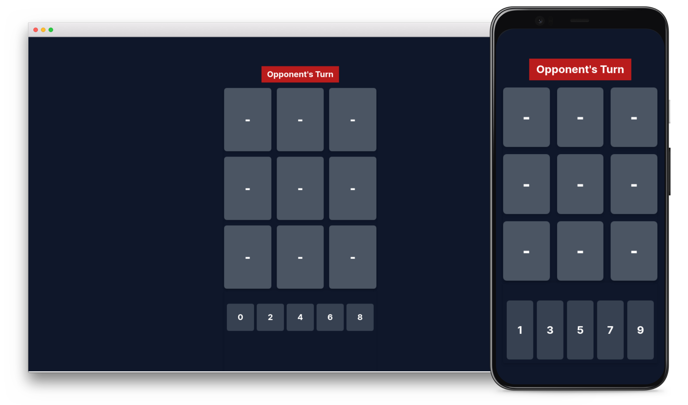

# Tic-Tac-Toe Math Multiplayer

Tic-Tac-Toe Math Multiplayer is a strategic and mathematical twist on the classic Tic-Tac-Toe game. Challenge your friends or other players in a battle of wits and numbers!



## Features

- Combines classic Tic-Tac-Toe with mathematical challenges.
- Multiplayer mode for engaging battles with friends or opponents.
- Strategic gameplay that requires planning and quick thinking.
- WebSocket communication for real-time moves and game updates.

## How to Play

The goal of the game is to form a line of three grids in <strong>any</strong> direction (horizontal,
vertical, or diagonal)
where the sum of the numbers is equal to <strong>15</strong>.

## Getting Started

Follow these steps to set up and run the game locally:

1. **Clone the Repository**

2. **Install Dependencies:**

   - Make sure you have Node.js and Go installed.
   - Install frontend dependencies:
     ```bash
     cd frontend
     npm install
     ```

3. **Run the Game:**

   - Start the backend (Go server):
     ```bash
     go run main.go
     ```
   - Start the frontend (Vue.js):
     ```bash
     cd frontend
     npm run dev
     ```

4. **Open the Game:**
   - Visit `http://localhost:5173` in your browser to play the game.
